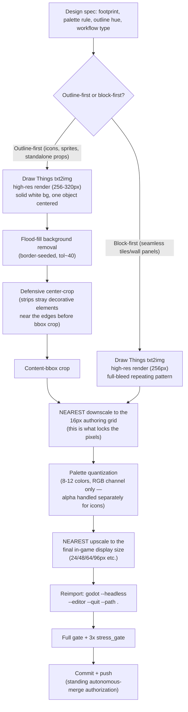

# 16-bit Pixel Art Pipeline

Owner-directed pipeline (2026-09-05), replacing the earlier soft-shaded
48x48 Draw Things pass for batches 3 onward. This doc is the reference
for how an asset gets made and the concrete failure modes hit while
building batches 3-6 — read the gap analysis before dispatching a new
batch, it's cheaper than re-discovering the same failures.

## Pipeline diagram

## Grid reference (per owner spec, amended 2026-09-05)

| Asset class | Authoring grid | Workflow |
|---|---|---|
| Seamless tiles (ground/water/wall panels) | 16×16, **strict, no exceptions** | block-first |
| Simple items, crops, small props | 16×16 | outline-first |
| Compound/complex objects (carts, market stalls, buildings, sluice gates — multi-part subjects that fail failure mode #6 below) | 24×24 or 32×32, scaled to fit the subject | outline-first |
| Character & NPC sprites, animals | 16×32 baseline, may go higher for a compound/detailed subject same as above | outline-first |
| Dialogue portraits | 64×64 | outline-first |

**Amendment (2026-09-05, owner directive)**: tiles stay strict 16×16 —
no exceptions, since seamless tiling depends on the grid discipline.
For "more important" non-tile objects (characters, animals, buildings,
and by extension any compound prop hitting failure mode #6 below), the
authoring grid may step up to 24×24 or 32×32 rather than forcing a
16×16 icon that loses its silhouette. Still NEAREST-scaled, still hard
pixel edges — only the authoring resolution changes, not the pipeline.

`TILE=48` in the engine is untouched — this is a visual-style pipeline,
not a resolution migration. Everything NEAREST-upscales from its
authoring grid to whatever the existing in-game display size already
is (24px UI icons, 48px world tiles/props, etc.).

## Gap analysis: failure modes hit, and the fix applied

Each of these was hit for real across batches 3-6's 16-bit redo, not
theoretical — logging them here so the next batch's prompts are written
defensively instead of re-discovering the same failure.

### 1. Model ignores "flat"/pure-geometry requests
**Symptom**: asked for a flat rounded UI panel or a flat-colored bar,
got a rendered/shaded/gradient result instead — same failure the
soft-shaded pass also hit for `structure_floor`/`structure_wall` on
its first try.
**Root cause**: the model is fundamentally an illustrative renderer;
"flat" is a weak signal against its training prior toward shading.
**Fix**: don't fight it. Pure geometric UI chrome (panels, bars,
frames) is hand-authored directly in PIL — faster, cheaper, and
strictly more correct than any prompt engineering here. Reserve AI
generation for assets with real illustrative content (a subject,
texture, or scene).

### 2. Model ignores "hollow"/negative-space requests
**Symptom**: `heart_empty` (explicitly "hollow outline only, no fill")
came back as a fully filled heart, twice, across two separate prompt
attempts with strengthened negative prompts.
**Root cause**: same category as #1 — the model defaults to filling
enclosed shapes; negative-space instructions are weak signals.
**Fix**: don't re-prompt a third time. Derive the hollow variant
locally from the filled version's own pixel art (a simple erosion —
keep only pixels adjacent to a transparent neighbor, i.e. the outline
ring) instead. Generally: **if a variant is a structural transform of
an already-good asset (hollow vs filled, small vs large, green vs
gold), derive it locally rather than re-prompting** — this is the same
principle as `modular_asset_kit.md`'s base-panel-plus-recolor pattern.

### 3. Model adds an unrequested scene/composition
**Symptom**: `rice_paddy_stage2-4` (asked for an isolated plant-clump
icon) repeatedly composed a horizon-band or tiled-reflection scene
instead, across 2 full retry rounds with progressively stronger
negative prompts ("no horizon, no sky, no reflection, no scenery").
**Root cause**: some subjects (young rice specifically) apparently
have a strong training-data association with a "paddy field photo"
composition that negative prompts don't fully suppress.
**Fix**: same as #2 — stop re-prompting after 2 failed rounds. Either
(a) crop the clean portion of a partially-successful generation (this
worked for `water_surface` in the original soft-shaded pass), or (b)
derive the missing variants locally from the one clean generation via
scale/hue-shift (this is what shipped for stages 2-4).

### 4. Model adds an extra unrequested object in frame
**Symptom**: `clay_stove` generated with an extra fire-paddle and a
squash fruit alongside it; `clay_stove_tall` with an extra pot;
`market_stall` with a lamppost and trash bin. All from otherwise
single-subject prompts.
**Root cause**: the model treats "isolated on plain background" as
"a plausible small scene," not literally "exactly one object."
**Fix**: a manual pre-crop to the main subject's region (eyeballed
from the raw generation) before the automated flood-fill/content-bbox
pipeline runs. Cheap, reliable, doesn't need a re-generation.

### 5. Decorative elements near the frame edge widen the content bbox
**Symptom**: a heart-icon generation included small decorative hearts
in the corners; the automated content-bbox crop (which finds the
tightest box around all non-transparent pixels) then spanned the
*entire* canvas instead of just the main heart, crushing it to a few
pixels on the 16x16 downscale.
**Root cause**: content-bbox cropping assumes the only non-background
content IS the subject — false when the model adds unrequested
decoration near the edges (see #4, but specifically edge-adjacent).
**Fix**: `center_crop_frac()` — a defensive crop to the center 50-65%
of the canvas, applied BEFORE the content-bbox step, added directly
into `pixel16_pipeline.py`. Strips edge decoration unconditionally.
Tradeoff: also clips a legitimately large/wide subject if the crop
fraction is too aggressive — tune per-asset (a wide subject like
`merchant_cart` needs a larger `center_frac`, e.g. 0.65, than a small
centered icon like a heart, which is fine at 0.5).

### 6. Extreme downscale (16×16) crushes compound/complex subjects
**Symptom**: `merchant_cart` (canopy + baskets + wheels + frame, 4+
distinct visual sub-parts) became an unreadable color-block mess at
16×16 even with a clean source generation and correct cropping.
**Root cause**: 16×16 has ~256 total pixels of budget; a subject with
many small distinct parts loses its silhouette entirely once each
part is only 2-4px.
**Fix, in order of preference**: (a) simplify the PROMPT itself toward
"bold simple shapes, minimal detail" so the model renders something
that survives the downscale, rather than trying to preserve a detailed
render through a lossy resize; (b) **step the authoring grid up to
24×24 or 32×32 for compound objects** — owner-confirmed amendment
(2026-09-05, see the Grid reference table above): tiles stay strict
16×16, but characters/animals/buildings/complex props are allowed a
larger authoring grid rather than forcing a silhouette-losing 16×16.

### 7. Washed-out / low-contrast output on a second attempt
**Symptom**: `structure_wall_cap`/`structure_wall_front`'s first 16-bit
pass came out too pale to read as a distinct wall texture (a near-
repeat of the exact failure the soft-shaded pass hit on the same two
files, and on `silver_coin`).
**Root cause**: unclear — possibly steps=4/cfg=1.0 (schnell's
recommended fast-inference settings) undershoots saturation for
warm-neutral subjects specifically; every washed-out failure this
project has hit has been a cream/white/pale-colored subject.
**Fix applied reactively**: add "bold saturated color," "vivid not
pale," and negate "pale, washed out, low contrast, faded" explicitly.
**Recommendation for prevention**: for any warm-neutral/pale subject
(plaster, cream cloth, bone, stone), bake "bold saturated color, vivid
not pale" into the prompt template from the START rather than waiting
for a washed-out first attempt — this is now a known-risky subject
class, not a surprise.

## Recommendations for the next batch (portraits, batch 7-9)

1. **Portraits (64×64, outline-first)**: given #6 above, a face has
   comparable compound-subject risk to the market cart — eyes, hair,
   clothing, and an expression all need to survive the downscale.
   64×64 gives ~16x the pixel budget of a 16×16 icon, which should be
   enough, but treat the first 2-3 portraits as a validation checkpoint
   before running the rest of the roster unattended.
2. **Character sprites (batch 9, 16×32, 3/4 top-down)**: this is a
   genuinely different asset shape (multi-frame walk/idle sheets, not
   a single bust) — Draw Things' txt2img endpoint doesn't natively
   produce a sprite sheet. Needs a design decision (generate one base
   keyframe + hand/tool-animate the rest, per the owner's own
   Gap-Closing Strategy for animated sprites) before dispatch, not
   just a prompt list. Do not start batch 9 without that decision.
3. **Crops/items (batches 7-8, ~239 files combined)**: apply the
   defensive `center_crop_frac` + "bold simple shapes" prompt
   guidance from the START (failure modes #4-#6 above are now known,
   not hypothetical) rather than discovering them again per-file.
4. Keep validating on 1 test asset before dispatching a new *category*
   of subject (a new material, a new compound-object type) — this is
   what caught the heart-icon pipeline bug before it silently
   propagated into all 3 batch-3 icons.
